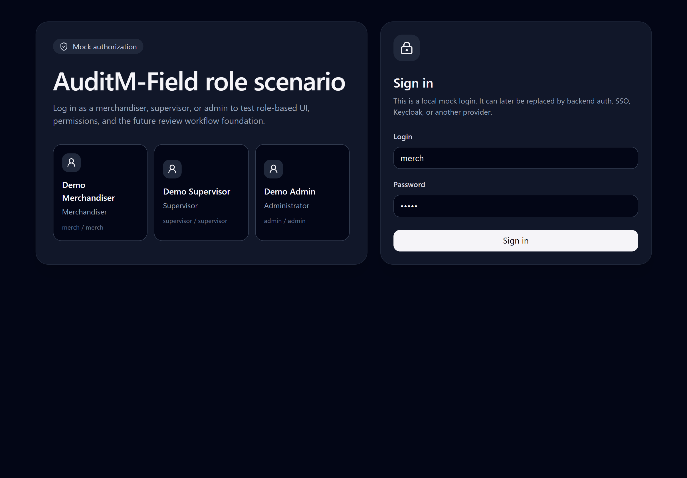
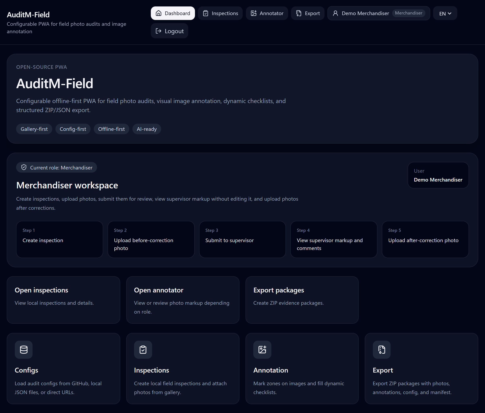
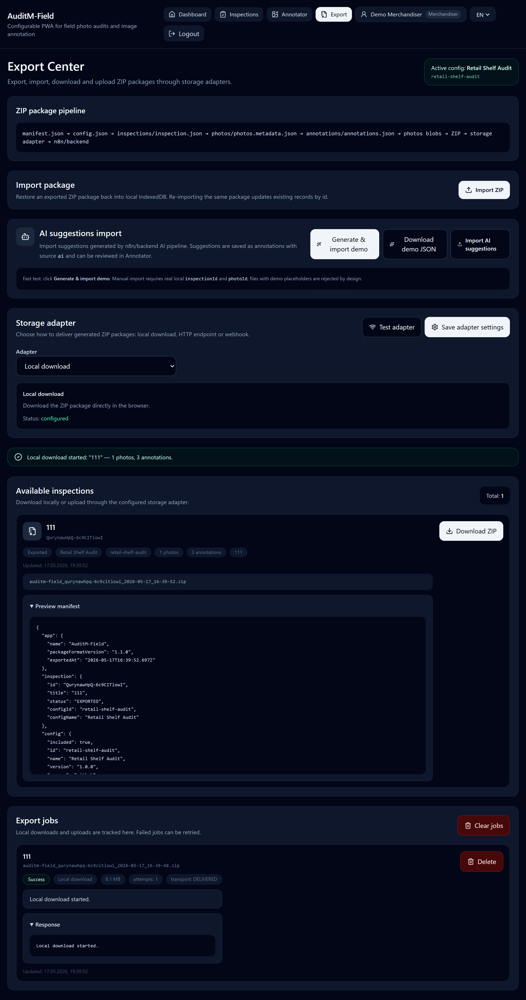

# Screenshots

Screenshots for README, GitHub, portfolio pages, and project presentation materials.

Store screenshots in:

```text
docs/assets/screenshots/
```

---

## Current screenshots

| File                                             | Screen                           | Purpose                                                                                              |
| ------------------------------------------------ | -------------------------------- | ---------------------------------------------------------------------------------------------------- |
| `01-login-ru.png`                                | Login                            | Shows mock authorization and role selection in Russian.                                              |
| `02-dashboard-merchandiser-ru.png`               | Dashboard / Merchandiser         | Shows merchandiser workspace, role badge and workflow steps.                                         |
| `03-dashboard-supervisor-en.png`                 | Dashboard / Supervisor           | Shows supervisor workspace in English.                                                               |
| `04-config-manager.png`                          | Config Manager                   | Shows GitHub config registry, local JSON import, demo config loading and active config summary.      |
| `05-inspections-list.png`                        | Inspections                      | Shows local inspection creation and stored inspections in IndexedDB.                                 |
| `06-inspection-detail-merchandiser-readonly.png` | Inspection Detail / Merchandiser | Shows checklist/photo gallery with read-only constraints where applicable.                           |
| `07-inspection-detail-supervisor.png`            | Inspection Detail / Supervisor   | Shows supervisor-accessible review scenario.                                                         |
| `08-annotator-supervisor-edit.png`               | Photo Annotator / Supervisor     | Shows editable annotation workspace, filters and dynamic form.                                       |
| `09-annotator-merchandiser-readonly.png`         | Photo Annotator / Merchandiser   | Shows supervisor markup visible in read-only mode.                                                   |
| `10-annotator-ai-review.png`                     | Photo Annotator / AI Review      | Shows pending AI suggestion, confidence and accept/reject controls.                                  |
| `11-export-center.png`                           | Export Center                    | Shows ZIP pipeline, import/export, storage adapter, available inspections and export jobs.           |
| `12-settings.png`                                | Settings                         | Shows storage, external transport, annotator entry point, local-first data and AI-ready layer notes. |

---

## Recommended screenshot checklist

### Login

Show:

```text
- app name
- mock authorization badge
- role cards
- login/password form
- RU and EN examples if possible
```

### Dashboard

Show:

```text
- current role badge
- user name
- role-specific workflow steps
- quick actions available for the current role
```

### Config Manager

Show:

```text
- GitHub config registry
- demo config
- active config
- validation/summary counters
```

### Inspections

Show:

```text
- new inspection form
- local inspections
- statuses
- create/delete actions
```

### Inspection Detail

Show:

```text
- inspection metadata
- checklist
- photo gallery
- status switch
- read-only message for restricted roles
```

### Annotator Entry

Show:

```text
- recent photos
- inspection groups
- open annotator action
```

### Photo Annotator / Supervisor

Show:

```text
- image annotation area
- selected annotation
- annotation panel
- visible type filter
- source filter
- dynamic form block
- delete/edit controls
```

### Photo Annotator / Merchandiser

Show:

```text
- same supervisor markup visible
- read-only help text
- disabled form fields
- no delete/edit/AI review controls
```

### AI Review

Show:

```text
- pending AI source filter
- confidence
- AI metadata
- accept/reject controls for supervisor/admin
```

### Export Center

Show:

```text
- ZIP pipeline
- import package
- AI suggestions import
- storage adapter
- available inspections
- export jobs
```

### Settings

Show:

```text
- storage adapters
- external transport
- annotator entry point
- AI-ready layer
- local-first data
```

---

## README image block

Recommended README block:


## Screenshots

### Login



### Merchandiser dashboard



### Supervisor annotator


### Merchandiser read-only markup


### Export Center




---

## Screenshot style

Recommended browser width:

```text
1440px or wider
```

Recommended capture areas:

```text
- full page for documentation
- focused component for README
- mobile/responsive view for PWA demonstration
```

Avoid screenshots with:

```text
- personal data
- real customer data
- real store names
- real brand names if not allowed
```
