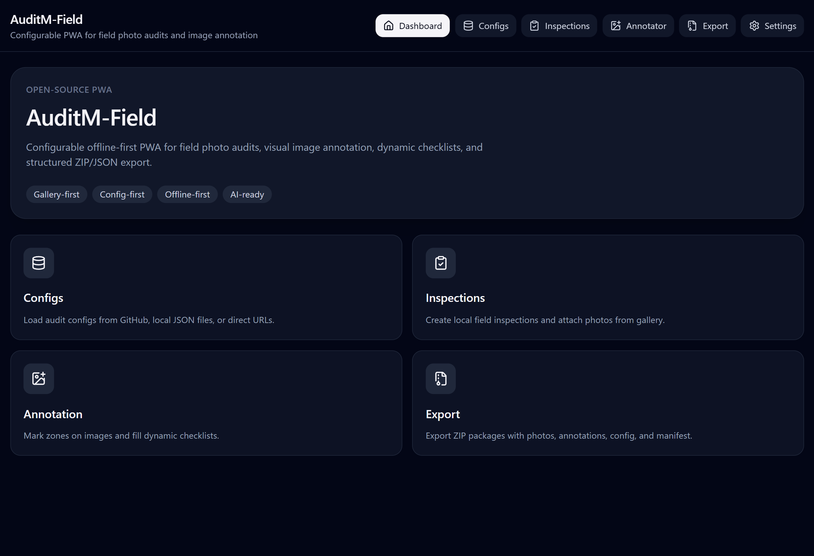
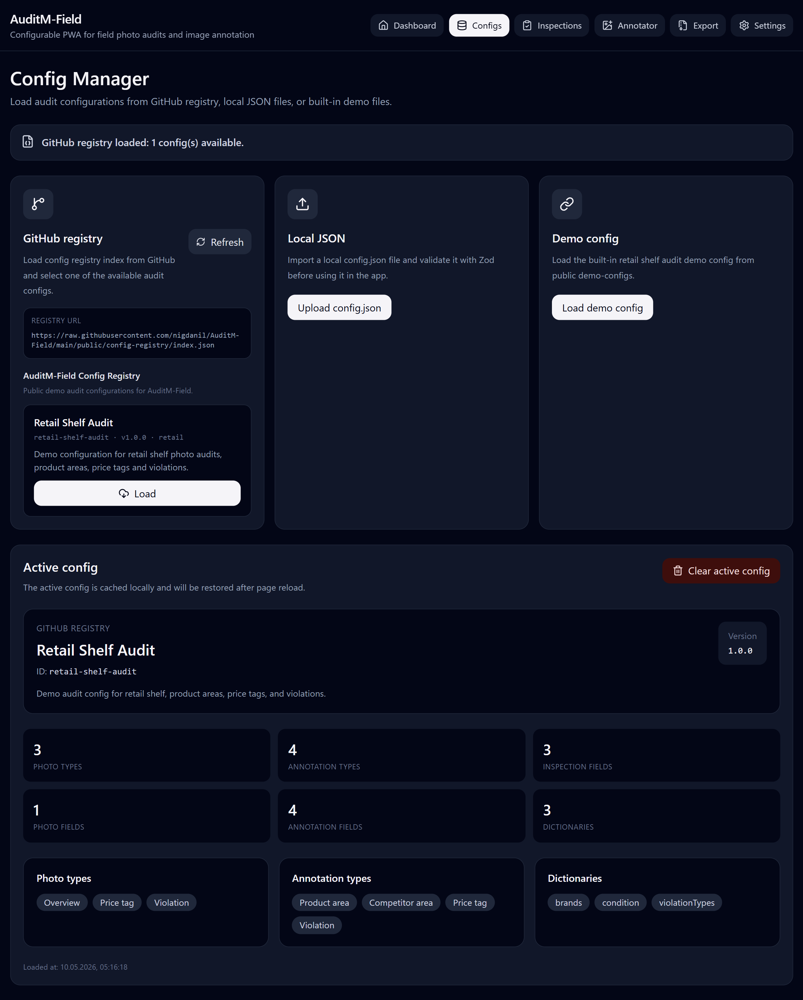
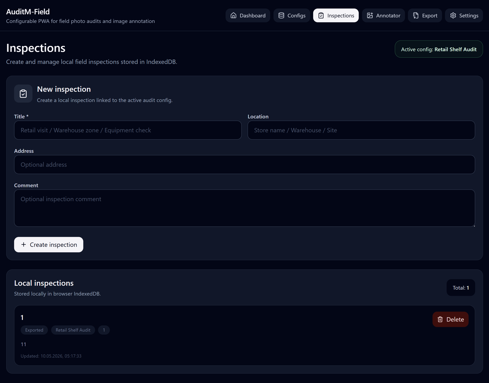
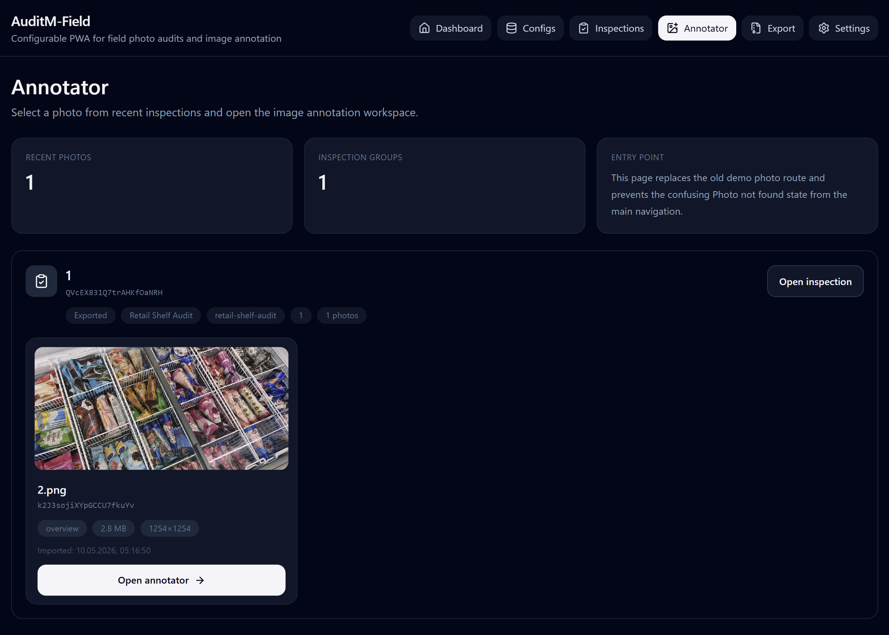
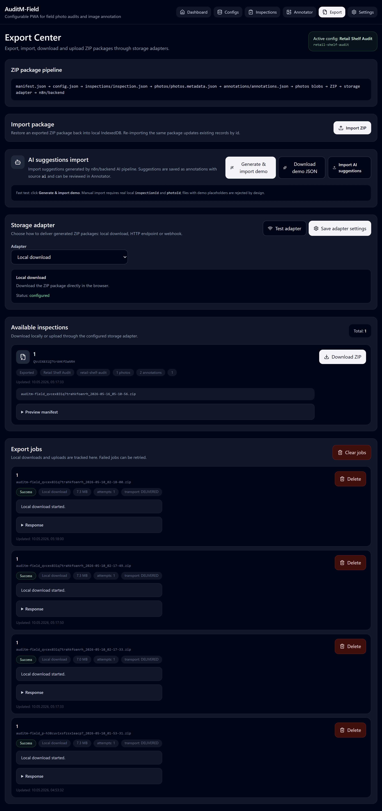
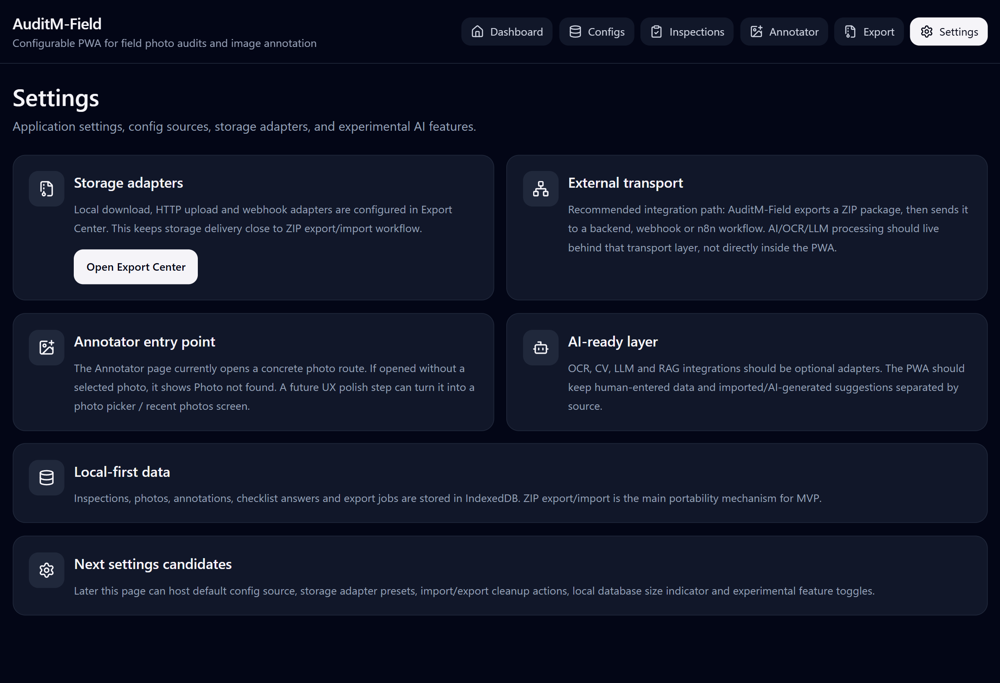

# Screenshots

Screenshots for README, GitHub, portfolio pages, and project presentation materials.

Store screenshots in:

```text
docs/assets/screenshots/
```

## Current screenshots

| File                       | Screen            | Purpose                                                                                              |
| -------------------------- | ----------------- | ---------------------------------------------------------------------------------------------------- |
| `01-dashboard.png`         | Dashboard         | Main product overview: app name, navigation, positioning tags and feature cards.                     |
| `02-config-manager.png`    | Config Manager    | Shows GitHub config registry, local JSON import, demo config loading and active config summary.      |
| `03-inspections-list.png`  | Inspections       | Shows local inspection creation and stored inspections in IndexedDB.                                 |
| `04-inspection-detail.png` | Inspection Detail | Reserved for inspection metadata, checklist and photo gallery screen.                                |
| `05-annotator-entry.png`   | Annotator Entry   | Shows recent photos and entry point into the annotation workspace.                                   |
| `06-photo-annotator.png`   | Photo Annotator   | Shows image annotation workspace, annotation panel, filters, AI review and dynamic form area.        |
| `08-export-center.png`     | Export Center     | Shows ZIP pipeline, import/export, storage adapter, available inspections and export jobs.           |
| `12-settings.png`          | Settings          | Shows storage, external transport, annotator entry point, local-first data and AI-ready layer notes. |

## Recommended screenshot checklist

### Dashboard

Show:

```text
- app name
- navigation
- product positioning
- overview cards
```

### Config Manager

Show:

```text
- GitHub config registry
- demo config
- active config
- validation/summary counters
```

### Inspections

Show:

```text
- new inspection form
- local inspections
- statuses
- create/delete actions
```

### Annotator Entry

Show:

```text
- recent photos
- inspection groups
- open annotator action
```

### Photo Annotator

Show:

```text
- image annotation area
- annotation panel
- visible type filter
- source filter
- AI review block
- dynamic form block
```

### Export Center

Show:

```text
- ZIP pipeline
- import package
- AI suggestions import
- storage adapter
- available inspections
- export jobs
```

### Settings

Show:

```text
- storage adapters
- external transport
- annotator entry point
- AI-ready layer
- local-first data
```

## README image block

Recommended README block:


## Screenshots

### Dashboard



### Config Manager



### Inspections



### Annotator Entry



### Photo Annotator


### Export Center



### Settings




## Screenshot style

Recommended browser width:

```text
1440px or wider
```

Recommended capture areas:

```text
- full page for documentation
- focused component for README
```

Avoid screenshots with:

```text
- personal data
- real customer data
- real store names
- real brand names if not allowed
```

